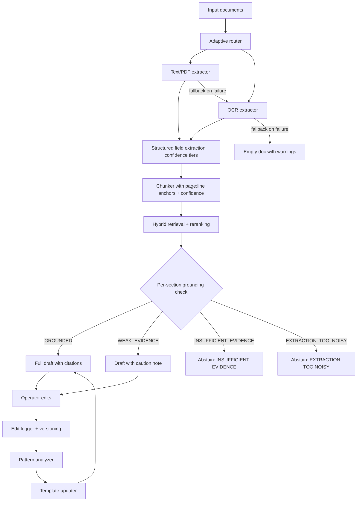

# Pearson Specter Litt — Grounded Document Understanding Pipeline

A complete document-understanding system that ingests messy legal-style documents, extracts usable text and structured fields, retrieves citation-backed evidence, generates grounded first-pass internal memos, and improves future drafts by learning from operator edits.

---

## Table of Contents

1. [Results Snapshot](#results-snapshot)
2. [Design Philosophy](#design-philosophy)
3. [Architecture Diagram](#architecture-diagram)
4. [Repository Layout](#repository-layout)
5. [Setup & Installation](#setup--installation)
6. [Running the Pipeline](#running-the-pipeline)
7. [API Server](#api-server)
8. [Docker Deployment](#docker-deployment)
9. [Draft Output Type](#draft-output-type)
10. [Processing Strategy](#processing-strategy)
11. [Sample Corpus](#sample-corpus)
12. [Evaluation](#evaluation)
13. [Tests](#tests)
14. [Reviewer Artifacts](#reviewer-artifacts)
15. [Tradeoffs & Assumptions](#tradeoffs--assumptions)
16. [Submission Checklist](#submission-checklist)

---

## Results Snapshot

| Bundle | Description | Avg Confidence | Evidence Coverage | Unsupported Claims | Overall Grounding |
| --- | --- | --- | --- | --- | --- |
| case_a | Noisy scanned contract dispute | 0.747 | 1.000 | 0 | GROUNDED |
| case_b | Clean complaint + email chain | 0.960 | 1.000 | 0 | GROUNDED |
| case_c | Mixed-format asset deal | 0.800 | 1.000 | 0 | GROUNDED |
| case_d | Deliberately nasty (illegible, conflicting) | 0.640 | 0.714 | 2 | INSUFFICIENT_EVIDENCE |

**Improvement loop results (case_a):**

| Metric | Before Learning | After Learning |
| --- | --- | --- |
| Substantive memo lines | 9 | 12 |
| Evidence coverage | 1.000 | 1.000 |
| Overall grounding | GROUNDED | GROUNDED |
| Template: min_evidence_per_section | 1 | 3 |
| Template: retrieval_boost_terms | [] | [section, section 8, $185,000, October 5 1984, …] |

---

## Design Philosophy

- **Disciplined grounding over fluency**: the system says "insufficient evidence" instead of guessing when retrieval is weak or OCR is too noisy.
- **Robustness over polish**: messy inputs degrade gracefully — fallback chains, unclear markers, and empty-document handling prevent crashes.
- **Inspectability**: every draft bullet has an inline citation, every section has a grounding status, and the support map is exported as JSON for reviewer inspection.
- **Real improvement loop**: operator edits update future drafting defaults — section ordering, phrasing style, retrieval boosts, missing-field patterns — not just stored as passive diffs.
- **Confidence transparency**: low-confidence lines are marked `[UNCLEAR]`, noisy sources get `⚠ LOW-CONF SOURCE` tags, and skipped regions are reported.

---

## Architecture Diagram



---

## Repository Layout

```
.
├── README.md                          ← You are here
├── ARCHITECTURE.md                    ← Detailed architecture with data flow
├── ASSUMPTIONS.md                     ← Assumptions and tradeoffs
├── CHECKPOINT.md                      ← Development checkpoint log
├── RUBRIC_ALIGNMENT.md               ← Rubric point-by-point coverage
├── requirements.txt                   ← Python dependencies
├── Dockerfile                         ← Container build
├── docker-compose.yml                 ← One-command deployment
├── Makefile                           ← Convenience commands (make test, make all, etc.)
├── .gitignore
│
├── data/
│   ├── templates_v1.json              ← Baseline template settings
│   ├── templates_v2_learned.json      ← Learned template (after edit feedback)
│   ├── edits.jsonl                    ← Edit log (gitignored, generated at runtime)
│   └── template_history.jsonl         ← Version history (gitignored, generated at runtime)
│
├── samples/
│   ├── case_files/
│   │   ├── case_a/                    ← Noisy scanned contract dispute (3 files)
│   │   ├── case_b/                    ← Clean complaint + email chain (2 files)
│   │   ├── case_c/                    ← Mixed-format asset deal + redactions (2 files)
│   │   └── case_d/                    ← Deliberately nasty: illegible, conflicting (2 files)
│   └── expected_outputs/
│       ├── case_a_extraction.json     ← Extraction output for case_a
│       ├── case_a_grounding.json      ← Grounding support map for case_a
│       ├── case_a_memo.md             ← Baseline memo for case_a
│       ├── case_a_original_memo.md    ← Memo before operator edit
│       ├── case_a_operator_edit.md    ← Simulated operator edit
│       ├── case_a_learned_memo.md     ← Memo after learning from edit
│       ├── case_b_extraction.json     ← Extraction output for case_b
│       ├── case_b_memo.md             ← Memo for case_b (GROUNDED)
│       ├── case_b_grounding.json      ← Grounding support map for case_b
│       ├── case_c_extraction.json     ← Extraction output for case_c
│       ├── case_c_memo.md             ← Memo for case_c (GROUNDED)
│       ├── case_c_grounding.json      ← Grounding support map for case_c
│       ├── case_d_extraction.json     ← Extraction output for case_d
│       ├── case_d_memo.md             ← Memo for case_d (INSUFFICIENT_EVIDENCE, with abstain)
│       ├── case_d_grounding.json      ← Grounding support map for case_d
│       └── evaluation_report.md       ← Full evaluation across all cases
│
├── scripts/
│   ├── run_extraction.py              ← Extract documents from a case directory
│   ├── generate_draft.py              ← Generate a grounded memo
│   ├── simulate_edit.py              ← Simulate operator edit + trigger learning
│   ├── evaluate_all.py               ← Evaluate all cases and produce report
│   └── run_case_demo.py              ← One-command end-to-end demo
│
├── src/
│   ├── __init__.py
│   ├── schema.py                      ← Data models, enums, defaults
│   ├── router.py                      ← Adaptive document routing
│   ├── pipeline.py                    ← Top-level pipeline orchestration
│   ├── utils.py                       ← JSON I/O, tokenization, cosine similarity
│   ├── structured.py                  ← Regex-based structured field extraction
│   │
│   ├── api/
│   │   ├── __init__.py
│   │   ├── models.py                  ← Pydantic request/response models
│   │   └── endpoints.py              ← FastAPI route handlers
│   │
│   ├── chunks/
│   │   ├── __init__.py
│   │   ├── chunker.py                 ← Line → chunk grouping with provenance
│   │   └── embeddings.py             ← Lightweight TF-IDF vector index
│   │
│   ├── edits/
│   │   ├── __init__.py
│   │   ├── analyzer.py               ← Edit pattern detection (9 pattern types)
│   │   ├── logger.py                  ← JSONL edit logging
│   │   ├── updater.py                ← Apply learned patterns to template settings
│   │   └── versioning.py             ← Template version history tracking
│   │
│   ├── evaluation/
│   │   ├── __init__.py
│   │   ├── metrics.py                 ← Extraction and draft metrics
│   │   ├── grounding_metrics.py      ← Citation validation, grounding score
│   │   ├── human_eval.py             ← Human evaluation prompt generator
│   │   └── report_generator.py       ← Markdown report generation
│   │
│   ├── extractors/
│   │   ├── __init__.py
│   │   ├── base_extractor.py         ← Confidence tiers, unclear detection, skipped regions
│   │   ├── pdf_extractor.py          ← pypdf-based extraction
│   │   ├── ocr_extractor.py          ← pytesseract / sidecar extraction
│   │   └── mixed_extractor.py       ← Router + fallback chains
│   │
│   ├── retrieval/
│   │   ├── __init__.py
│   │   ├── hybrid_search.py          ← Lexical + TF-IDF + reranking search
│   │   ├── top_k_rerank.py           ← Section/entity/date/confidence bonuses
│   │   └── provenance.py             ← Citation string generation
│   │
│   └── templates/
│       ├── __init__.py
│       ├── template_engine.py        ← Grounded memo generation with abstain logic
│       ├── validators.py             ← Unsupported/unclear claim detection
│       └── confidence_report.py     ← Confidence summary reporting
│
└── tests/
    ├── test_structured.py            ← Structured field extraction
    ├── test_pipeline.py              ← Pipeline grounding and support map
    ├── test_learning.py              ← Edit learning and template updates
    ├── test_confidence.py            ← Confidence tier classification
    ├── test_grounding.py             ← Citation validation and grounding scores
    ├── test_edit_learning.py         ← Edit pattern detection (reorder, phrasing, missing fields)
    └── test_abstain.py              ← Abstain/fallback behavior on noisy inputs
```

---

## Setup & Installation

### Prerequisites

- **Python 3.10+** (the project uses `list[X]` type hints)
- **pip** (comes with Python)

### Step 1: Clone and enter the project

```bash
git clone <your-repo-url>
cd pearson-specter-litt
```

### Step 2: Create and activate a virtual environment

```bash
python -m venv .venv
```

**Windows:**
```bash
.venv\Scripts\activate
```

**macOS / Linux:**
```bash
source .venv/bin/activate
```

### Step 3: Install dependencies

```bash
pip install -r requirements.txt
```

This installs:
- `pypdf` — PDF text extraction
- `Pillow` + `pytesseract` — OCR support (optional; system Tesseract binary needed for real OCR)
- `fastapi` + `uvicorn` + `pydantic` + `python-multipart` — REST API server

> **Note**: The sample corpus uses `.ocr.txt` text sidecars instead of real PDF/image files, so Tesseract is **not required** to run the pipeline. All outputs are fully deterministic without any external OCR engine.

### Step 4: Verify installation

```bash
python -m unittest discover -s tests -v
```

You should see **39 tests passing**.

---

## Running the Pipeline

All commands assume the virtual environment is activated and you're in the project root directory.

### A. Extract documents from a case

Extracts text, line records, structured fields, confidence scores, and warnings from all files in a case directory:

```bash
python scripts/run_extraction.py \
  --input samples/case_files/case_a \
  --output samples/expected_outputs/case_a_extraction.json
```

**Output**: JSON file with per-document text, line records (with confidence tiers and unclear markers), structured fields, average confidence, warnings, and skipped regions.

### B. Generate a grounded memo

Produces a Markdown memo with inline citations and a JSON grounding support map:

```bash
python scripts/generate_draft.py \
  --input samples/case_files/case_a \
  --output samples/expected_outputs/case_a_memo.md \
  --evidence-output samples/expected_outputs/case_a_grounding.json
```

**Output**:
- A Markdown memo where every substantive bullet has an inline citation like `[complaint_scan.ocr.txt p1:5-8]`
- A grounding JSON with per-section support map and grounding status (GROUNDED / WEAK_EVIDENCE / INSUFFICIENT_EVIDENCE / EXTRACTION_TOO_NOISY)

### C. Run the edit-learning loop

Simulates an operator editing the draft, then uses the edit to learn improved template settings:

```bash
# Step 1: Simulate an operator edit and trigger learning
python scripts/simulate_edit.py \
  --input samples/case_files/case_a \
  --draft-output samples/expected_outputs/case_a_original_memo.md \
  --edited-output samples/expected_outputs/case_a_operator_edit.md \
  --template-output data/templates_v2_learned.json

# Step 2: Generate a new memo using the learned template
python scripts/generate_draft.py \
  --input samples/case_files/case_a \
  --output samples/expected_outputs/case_a_learned_memo.md \
  --template-path data/templates_v2_learned.json
```

**Result**: The learned memo has more substantive lines (9 → 12) and richer citations because the template now includes learned preferences for evidence density, retrieval boost terms, and section specificity.

### D. Evaluate all cases

Produces a comprehensive Markdown evaluation report across all four cases:

```bash
python scripts/evaluate_all.py \
  --input samples/case_files \
  --output samples/expected_outputs/evaluation_report.md
```

**Output**: Markdown report with per-case extraction metrics, grounding score detail, and improvement-loop before/after comparison.

### E. One-command end-to-end demo

Runs extraction → draft → edit simulation → learned draft → evaluation in a single command:

```bash
python scripts/run_case_demo.py \
  --input samples/case_files/case_a \
  --output-dir samples/expected_outputs
```

### F. Using the Makefile (optional)

A `Makefile` is provided for convenience. With `make` installed:

```bash
make test          # Run all 39 tests
make extract       # Extract all 4 cases
make draft         # Generate memos for all 4 cases
make learn         # Run edit-learning loop on case_a
make evaluate      # Evaluate all cases
make all           # Extract + draft + learn + evaluate
make api           # Start the API server
make clean         # Remove runtime artifacts
```

---

## API Server

### Start the server

```bash
uvicorn src.api.endpoints:app --reload --port 8000
```

Interactive Swagger docs available at `http://localhost:8000/docs`.

### Endpoints

| Method | Path | Request Body | Description |
| --- | --- | --- | --- |
| GET | `/health` | — | Health check → `{status: "ok", version: "1.0.0"}` |
| POST | `/upload?case_id=X` | Multipart files | Upload documents for a case |
| GET | `/extract/{case_id}` | — | Run extraction on uploaded documents |
| POST | `/draft` | `{case_id, template_path}` | Generate a grounded memo |
| GET | `/inspect/{case_id}` | — | Inspect per-section grounding support map |
| GET | `/grounding-score/{case_id}` | — | Get quantified grounding score |
| POST | `/edit` | `{case_id, original_draft, edited_draft, template_output_path}` | Submit operator edit and trigger learning |

### Example API workflow

```bash
# 1. Upload files for a case
curl -X POST "http://localhost:8000/upload?case_id=case_a" \
  -F "files=@samples/case_files/case_a/complaint_scan.ocr.txt" \
  -F "files=@samples/case_files/case_a/inspection_log.txt"

# 2. Extract text and structured fields
curl http://localhost:8000/extract/case_a

# 3. Generate a grounded memo
curl -X POST http://localhost:8000/draft \
  -H "Content-Type: application/json" \
  -d '{"case_id": "case_a"}'

# 4. Inspect which evidence supported which section
curl http://localhost:8000/inspect/case_a

# 5. Get a quantified grounding score
curl http://localhost:8000/grounding-score/case_a

# 6. Submit an operator edit to trigger learning
curl -X POST http://localhost:8000/edit \
  -H "Content-Type: application/json" \
  -d '{"case_id": "case_a", "original_draft": "...", "edited_draft": "..."}'
```

---

## Docker Deployment

```bash
docker compose up --build
```

- API available at `http://localhost:8000`
- Swagger docs at `http://localhost:8000/docs`
- `data/` directory mounted as volume for persistence across restarts

---

## Draft Output Type

This submission generates a **first-pass internal case memo** with the following sections:

| Section | Content | Source |
| --- | --- | --- |
| Summary | High-level overview of the dispute | Extracted fields + top evidence |
| Matter overview | Detailed factual background with citations | Retrieved evidence chunks |
| Key parties | Parties identified in the documents | Structured field extraction |
| Timeline | Chronology markers from the bundle | Date extraction + retrieval |
| Allegations and obligations | Claims and contractual duties | Retrieval + structured fields |
| Open questions | Unresolved issues, handwritten notes | Low-confidence / ambiguous evidence |

This format exercises the rubric well because it depends on:
- **Usable extraction** — dates, parties, sections, amounts must be correctly extracted
- **Retrieval relevance** — each section queries for specific evidence
- **Source-grounded drafting** — every bullet has inline citations
- **Meaningful operator edit feedback** — specificity, density, phrasing, ordering can all be improved

---

## Processing Strategy

### 1. Document Processing

The system accepts messy legal-style documents and produces structured, downstream-usable output.

**Routing** (`src/router.py`): Classifies each input file as clean text, PDF, or OCR-style content based on filename patterns and extension.

**Extraction** (`src/extractors/`): Each document is converted into:
- Normalized text
- Line records with page/line anchors, confidence scores, confidence tiers, and unclear-marker flags
- Structured fields (dates, parties, sections, amounts, allegations, obligations)

**Confidence tiers** — every line is classified as:

| Tier | Confidence Range | Meaning |
| --- | --- | --- |
| HIGH | ≥ 0.85 | Clean, reliable text |
| MEDIUM | 0.65 – 0.84 | Usable but may have minor artifacts |
| LOW | 0.45 – 0.64 | Significant noise; treat with caution |
| UNREADABLE | < 0.45 | Cannot be trusted; skip or flag |

**Unclear token detection**: Lines containing `[illegible]`, `???`, `[unreadable]`, `redacted`, or `unclear` are automatically flagged with `unclear_marker=True` and receive reduced confidence (capped at 0.64).

**Skipped region detection**: Consecutive blank lines are reported as potential skipped content in the extraction output.

**Fallback chains**: If PDF extraction fails, the system falls back to OCR sidecar; if OCR also fails, an empty document with warnings is returned — the pipeline **never crashes**.

### 2. Grounded Retrieval

The retrieval layer ensures generation is anchored to actual source material.

**Hybrid search** (`src/retrieval/hybrid_search.py`) combines three scoring signals:

| Signal | Weight | Description |
| --- | --- | --- |
| Lexical overlap | 55% | Fraction of query terms found in the chunk |
| TF-IDF cosine similarity | 35% | Lightweight semantic matching via term frequencies |
| Confidence signal | 10% | Chunk confidence as a quality signal |

**Reranking bonuses** (`src/retrieval/top_k_rerank.py`) are added on top:

| Bonus | Value | Trigger |
| --- | --- | --- |
| Section reference match | +0.08 | Query and chunk both contain "section" |
| Entity match | +0.07 | Named entity from query found in chunk |
| Digit co-occurrence | +0.05 | Both query and chunk contain digits |
| Date-pattern match | +0.06 | Query has date terms AND chunk has date patterns |
| Low-confidence penalty | -0.05 | Chunk confidence < 0.6 |

**Retrieval boost terms**: Learned from operator edits, these terms are appended to section queries to improve retrieval relevance over time.

**Every retrieval result preserves**: source file, page number, line span, chunk text, chunk confidence, all retrieval scores (lexical, semantic, rerank), and matched terms.

### 3. Draft Generation with Abstain Behavior

The template engine generates deterministic, evidence-aware memos.

**Per-section grounding check** — before drafting each section, the system classifies the evidence:

| Status | Condition | Action |
| --- | --- | --- |
| GROUNDED | ≥1 evidence chunk above min score, adequate confidence | Full draft with citations |
| WEAK_EVIDENCE | Evidence found but below minimum count | Draft with `*Weak evidence*` caution note |
| EXTRACTION_TOO_NOISY | Source confidence below threshold | Draft with `⚠ LOW-CONF SOURCE` warning |
| INSUFFICIENT_EVIDENCE | No evidence above minimum score | **Draft withheld** — `**INSUFFICIENT EVIDENCE**` marker |

**Global abstain**: If all documents have extraction confidence below the usable threshold (0.45), the entire memo is withheld.

**Citation format**: Every substantive bullet includes inline citations like `[complaint_scan.ocr.txt p1:5-8]` that resolve to actual source lines.

**Unclear content marking**: Low-confidence evidence is prefixed with `[UNCLEAR]` or tagged `⚠ LOW-CONF SOURCE`.

**Grounding export**: A JSON support map is generated showing which evidence supported which section, including per-section grounding status.

### 4. Improvement from Operator Edits

The system captures operator edits and extracts reusable patterns to improve future drafts.

**Edit capture** (`src/edits/logger.py`): Edits are logged to structured JSONL with case ID, original/edited text, detected patterns, recommendations, and metadata.

**Pattern detection** (`src/edits/analyzer.py`) — nine pattern types are detected:

| Pattern | What it detects | Template setting updated |
| --- | --- | --- |
| `added_section_specificity` | Operator added section/clause references | `require_section_citations = True` |
| `increased_citation_density` | Operator added more citations | `min_evidence_per_section` raised to ≥3 |
| `formalized_dates` | Operator preferred formal date style | `prefer_formal_dates = True` |
| `expanded_claim_descriptions` | Operator expanded terse claims | `claim_detail_expansion = "high"` |
| `reordered_sections` | Operator changed section order | `section_order` updated to match |
| `formalized_phrasing` | Operator used formal legal language | `phrasing_style = "formal"` |
| `informal_phrasing` | Operator used informal language | `phrasing_style = "informal"` |
| `missing_field_{X}` | Operator added field X that system missed | `retrieval_boost_terms` += [X] |
| `retrieval_boost_candidates` | Specific terms from edits | `retrieval_boost_terms` += candidates |

**Template updating** (`src/edits/updater.py`): Learned preferences are persisted into a versioned template config (`data/templates_v2_learned.json`).

**Template versioning** (`src/edits/versioning.py`): Every learning event is recorded to `data/template_history.jsonl` with timestamp, triggered patterns, and a full settings snapshot — providing a complete audit trail.

---

## Sample Corpus

Four synthetic bundles demonstrate different input quality levels:

| Case | Files | Input Quality | Key Features |
| --- | --- | --- | --- |
| case_a | 3 (OCR scan, text log, handwritten notes) | Noisy | OCR artifacts, unclear markers, handwritten margin notes |
| case_b | 2 (complaint, email chain) | Clean | Well-formatted text, cross-references, missing recording evidence |
| case_c | 2 (OCR scan, text addendum) | Mixed | Redactions, missing closing support, partial illegibility |
| case_d | 2 (damaged scan, partial note) | Nasty | Heavy `[illegible]`/`???`/`[unreadable]`, conflicting statements, zero extractable fields |

---

## Evaluation

The evaluation script (`scripts/evaluate_all.py`) reports metrics aligned to the assignment rubric:

### Per-case metrics

| Category | Metrics |
| --- | --- |
| Document processing | extraction confidence, structured-field completeness, usable chunk ratio, noisy document ratio |
| Retrieval & grounding | evidence coverage, citation precision (validated against source lines), unsupported claim rate, unclear claim rate, avg evidence confidence, per-section grounding status |
| Draft quality | section completion, substantive memo lines, overall grounding status |
| Improvement loop | changed template settings, before/after memo growth, edit-log count, template version history |

### Grounding score breakdown

The `compute_grounding_score` function produces a structured score per case:

| Metric | Definition |
| --- | --- |
| `evidence_coverage` | Fraction of substantive lines with citations |
| `citation_precision` | Fraction of citations that resolve to actual source lines (not just pattern-matched) |
| `unsupported_claim_rate` | Fraction of substantive lines flagged as unsupported |
| `unclear_claim_rate` | Fraction of substantive lines marked `[UNCLEAR]` or `LOW-CONF` |
| `avg_evidence_confidence` | Average confidence of evidence chunks used |
| `sections_grounded/weak/insufficient` | Per-section grounding counts |
| `overall_status` | GROUNDED / WEAK_EVIDENCE / INSUFFICIENT_EVIDENCE / EXTRACTION_TOO_NOISY |

Generated evaluation output: [samples/expected_outputs/evaluation_report.md](samples/expected_outputs/evaluation_report.md)

---

## Tests

**39 automated tests** across 7 test files:

| Test File | What it covers |
| --- | --- |
| `test_structured.py` | Structured field extraction (dates, parties, amounts, sections) |
| `test_pipeline.py` | Pipeline grounding, support map, section grounding, confidence in results |
| `test_learning.py` | Edit-pattern learning, template updates (citations, specificity, reordering, phrasing, missing fields) |
| `test_confidence.py` | Confidence tier classification (HIGH/MEDIUM/LOW/UNREADABLE) |
| `test_grounding.py` | Citation validation, citation extraction, grounding score computation |
| `test_edit_learning.py` | Section reordering, phrasing shifts, missing fields, retrieval boosts, comprehensive edit |
| `test_abstain.py` | Abstain behavior on case_d, unclear markers, grounding status on all cases |

Run all tests:

```bash
python -m unittest discover -s tests -v
```

---

## Reviewer Artifacts

- [Architecture overview](ARCHITECTURE.md) — detailed data flow and component descriptions
- [Assumptions and tradeoffs](ASSUMPTIONS.md) — design decisions and their consequences
- [Checkpoint log](CHECKPOINT.md) — development progress
- [Rubric alignment](RUBRIC_ALIGNMENT.md) — point-by-point rubric coverage
- [Case A extraction output](samples/expected_outputs/case_a_extraction.json)
- [Case A grounding package](samples/expected_outputs/case_a_grounding.json)
- [Case A baseline memo](samples/expected_outputs/case_a_memo.md)
- [Case A original memo (pre-edit)](samples/expected_outputs/case_a_original_memo.md)
- [Case A simulated operator edit](samples/expected_outputs/case_a_operator_edit.md)
- [Case A learned memo (post-edit)](samples/expected_outputs/case_a_learned_memo.md)
- [Case B extraction output](samples/expected_outputs/case_b_extraction.json)
- [Case B memo](samples/expected_outputs/case_b_memo.md)
- [Case B grounding package](samples/expected_outputs/case_b_grounding.json)
- [Case C extraction output](samples/expected_outputs/case_c_extraction.json)
- [Case C memo](samples/expected_outputs/case_c_memo.md)
- [Case C grounding package](samples/expected_outputs/case_c_grounding.json)
- [Case D extraction output](samples/expected_outputs/case_d_extraction.json)
- [Case D memo (with abstain)](samples/expected_outputs/case_d_memo.md)
- [Case D grounding package](samples/expected_outputs/case_d_grounding.json)
- [Evaluation report](samples/expected_outputs/evaluation_report.md)

---

## Tradeoffs & Assumptions

- **Deterministic drafting instead of an external LLM**: the repo stays runnable offline and cannot invent unsupported facts. Tradeoff: less expressive writing.
- **Rule-based field extraction**: transparent, deterministic, and auditable. Tradeoff: weaker recall on highly variable entity formats.
- **Lightweight in-memory retrieval**: zero infra, simpler reviewer experience. Tradeoff: less scalable for very large corpora.
- **Strict abstain behavior**: when evidence is insufficient, the system withholds rather than guesses. Tradeoff: some sections produce no content on weak cases.
- **Citation validation against source lines**: citation precision is a real metric, not inflated. Tradeoff: slightly more complex evaluation code.
- **Learning loop targets draft behavior**: section order, phrasing, retrieval boosts, evidence density. Tradeoff: does not yet feed corrections back into extraction or ranking weights.

---

## Submission Checklist

- [x] Source code included
- [x] README with setup and run instructions included
- [x] Architecture overview included
- [x] Assumptions and tradeoffs included
- [x] Sample inputs and outputs included
- [x] Evaluation approach and results included
- [x] API endpoints included (7 endpoints)
- [x] Docker setup included
- [x] Tests included (39 passing)
